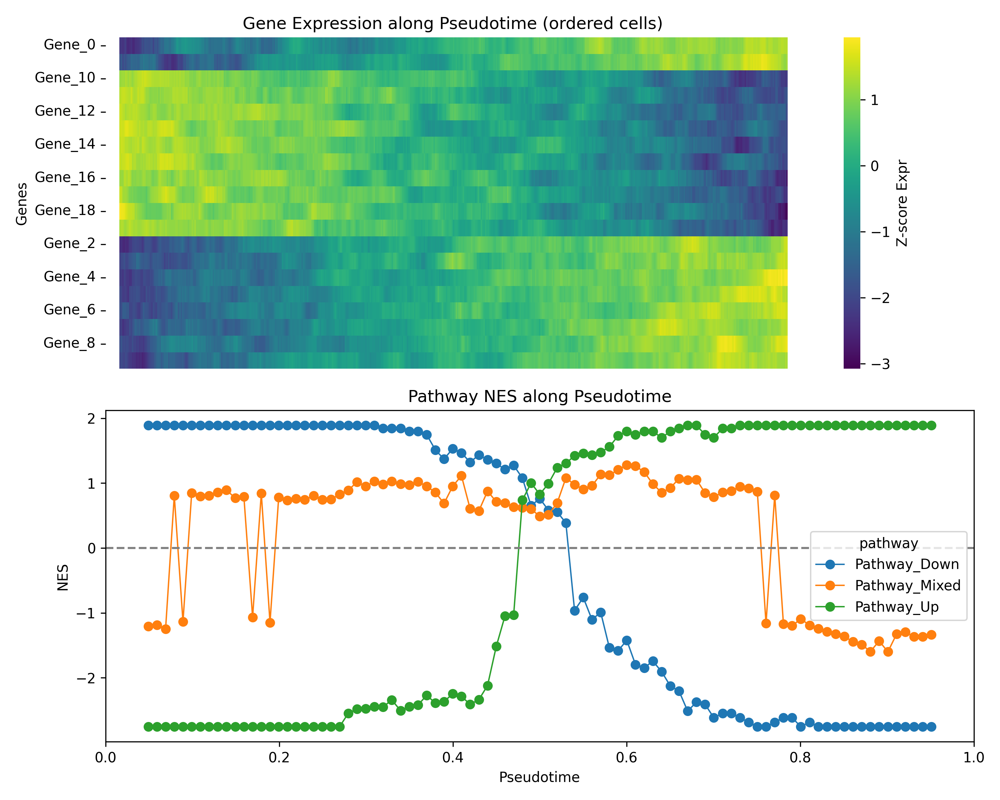

# PyFgsea: High-Performance GSEA in Python & Rust

**PyFgsea** is a hyper-optimized Python library for Gene Set Enrichment Analysis (GSEA), powered by a Rust backend. It implements the "Multilevel Split Monte Carlo" algorithm to achieve orders-of-magnitude speedups over existing Python implementations while maintaining high consistency with the reference R fgseaMultilevel methodology.

## Key Features
- **Speed**: Up to 100x faster than pure Python implementations.
- **Precision**: ES/NES match closely across datasets, and extreme-tail multilevel P-value behaviour is evaluated via the provided reproduction scripts.
- **Scalability**: Efficient rolling-window GSEA for single-cell trajectory analysis.
- **Python-first API**: Designed for seamless integration with pandas and scanpy workflows.

## Installation

### Prerequisites
- Python 3.8+
- Rust toolchain (stable)
- Tested on Linux/Windows, Python 3.10–3.11 (CI)

### Install from Source

**Recommended (Standard):**
```bash
git clone https://github.com/shayuanxukuang/pyfgsea.git
cd pyfgsea
pip install --upgrade pip maturin
pip install .           # Standard installation
# OR
pip install -e .        # Editable/Development mode
```

**For Rust Development:**
```bash
maturin develop --release
```

## Quick Start

Here is a minimal example to get you running in seconds.

```python
import pandas as pd
import pyfgsea

# 1. Prepare Data
# Option A: DataFrame (Customizable column names)
df = pd.DataFrame({
    'gene_name': ['GeneA', 'GeneB', 'GeneC', 'GeneD', 'GeneE'],
    'score': [2.5, 1.8, 0.5, -0.2, -1.5]
})

# Option B: Series (Index=Gene, Value=Score)
# scores = df.set_index('gene_name')['score']

# 2. Define Pathways (Dict of List)
pathways = {
    'Pathway_1': ['GeneA', 'GeneB'],
    'Pathway_2': ['GeneD', 'GeneE']
}

# 3. Run GSEA
# For DataFrame: specify gene_col and score_col
res = pyfgsea.run_gsea(
    data=df,
    gmt=pathways,
    gene_col='gene_name',
    score_col='score',
    min_size=1,     # Lower for toy example
    max_size=500,
    nperm_nes=100
)

# 4. View Results
res.columns = [c.lower() for c in res.columns]
print(res[["pathway", "nes", "pval", "padj", "es"]])
```

### Input Formats
- **DataFrame**: Must contain a gene column and a ranking score column. Specify via `gene_col` and `score_col`.
- **Series**: Index must be gene names, values must be ranking scores.
- **Deduplication**: Default strategy (`dedup_genes='max_abs'`) retains the gene entry with the highest absolute score.

### Output Columns
Example below normalizes columns to lowercase for display.
- `pathway`: Pathway name
- `pval`: Multilevel P-value
- `padj`: Benjamini-Hochberg adjusted P-value
- `es`: Enrichment Score
- `nes`: Normalized Enrichment Score
- `size`: Size of the pathway after filtering
- `log2err`: P-value estimation error metric
- `n_levels`: Multilevel depth used for the result
- `pval_capped`: Whether p-value hit the eps floor

## Trajectory (rolling-window) GSEA along pseudotime

PyFgsea supports rolling-window preranked GSEA to track pathway activity changes along single-cell trajectories.
It is designed to run **many windows efficiently** via a stateful runner.

<p align="center">
  
</p>

### One-command demo

> **Note**: Requires `anndata` (and optionally `scanpy` for convenience).
> This is a synthetic toy dataset for demonstration only (not biological data).

```bash
# from the repo root
python examples/trajectory_demo.py \
  --adata repro/data/toy_trajectory.h5ad \
  --pseudotime-key dpt_pseudotime \
  --outdir results/
```

### What the plot shows
- **Cells are ordered by pseudotime.**
- **A sliding window moves along this ordering** (window size = `window_size`, step = `step`).
- **Points denote window centers** (`pt_mid`), and curves are lightly smoothed for display.
- **Preranked GSEA is run per window** to obtain ES/NES and FDR.

### Ranking statistic
`mean(expression in window) − mean(expression outside window)` on log1p-normalized expression.

### Key parameters
- `window_size`: number of cells per window (larger = smoother, smaller = higher resolution)
- `step`: stride between windows (smaller = more windows)
- `min_size`, `max_size`: gene set size filters
- `eps`, `sample_size`: multilevel sampling controls
- `n_threads`: CPU threads
Defaults: `window_size=50`, `step=5`, `min_size=5`, `max_size=500`, `nperm_nes=1000`, `seed=42`.

### Outputs
- `results/trajectory_demo.png`: marker expression and pathway NES dynamics along pseudotime
- `results/trajectory_gsea_table.tsv`: per-window GSEA results (ES, NES, pval, FDR, window index)

### Notes
- Synthetic toy dataset for demonstration only (not biological data).
- Expected trend: Pathway_Up increases and Pathway_Down decreases along pseudotime.

## Reproducing Paper Results

We provide a complete suite of reproduction scripts in the `repro/` directory.

### Reproducibility (with/without R)

The core reproduction scripts can run in pure Python mode (skipping R benchmarks if R is missing) or full comparison mode.
Recommended setup: `pip install -e .` with `numpy`, `pandas`, `scipy`, `anndata`, `matplotlib` available.

**Core Commands:**
```bash
python repro/fig_ablation_tail.py
python repro/fig_supp_tail_consistency.py
```

### R Baseline (Optional)
To run the full R baseline comparison, ensure `Rscript` is in your PATH and the `fgsea` package is installed.

```r
# In R console:
install.packages("BiocManager")
BiocManager::install("fgsea")
```

> **Note**: If R is not found, the reproduction scripts will gracefully skip the comparison steps and only run the Python benchmarks.

For full details, see [repro/README.md](repro/README.md).

## Citation
If you use PyFgsea in academic work, please cite:
> Manuscript in preparation.

## License
MIT License. See [LICENSE](LICENSE) for details.
